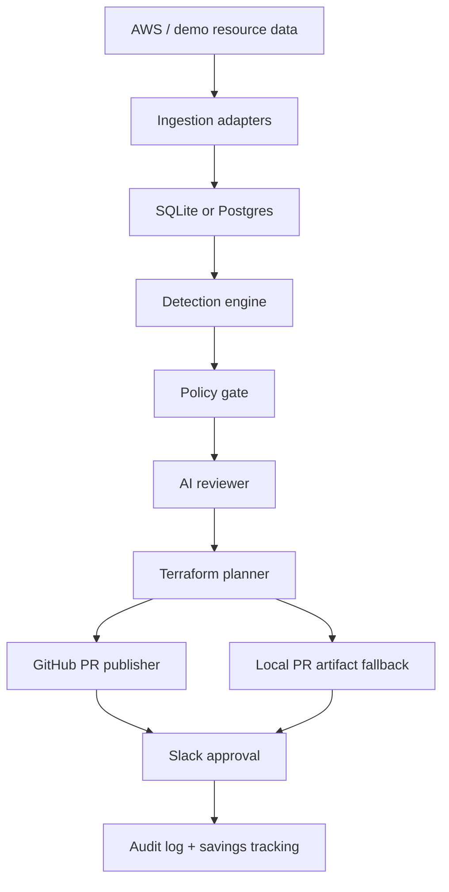
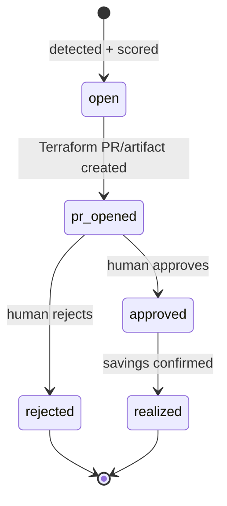

# Architecture

CloudPilot is organized around one rule: recommendations can be automated, but
infrastructure changes must remain reviewable.

## System components

## Data model

### Resource

Normalized cloud inventory record.

- `id`
- `account_id`
- `type`
- `name`
- `region`
- `terraform_address`
- `monthly_cost`
- `tags`
- `metrics`
- `config`

### Recommendation

Actionable remediation candidate.

- `resource_id`
- `action`
- `current_config`
- `proposed_config`
- `savings_monthly`
- `risk_level`
- `confidence`
- `evidence`
- `rationale`
- `rollback_plan`
- `policy_status`
- `status`
- `terraform_patch`
- `pr_url`

### Audit event

Append-only operational trace.

- `actor`
- `action`
- `target_type`
- `target_id`
- `details`
- `created_at`

## Recommendation lifecycle

## Safety model

CloudPilot does not:

- run `terraform apply`
- delete AWS resources directly
- resize production systems directly
- auto-merge GitHub PRs
- print secret values in diagnostics

CloudPilot does:

- generate reviewable Terraform diffs
- open draft PRs
- mark destructive changes as `needs_review`
- block risky recommendations when reliability signals are unhealthy
- record audit events for scoring, PR creation, approvals, rejections, and savings

## Live integration boundaries

### AWS

The AWS adapter uses boto3 to fetch:

- EC2 instances and CloudWatch CPU/network metrics
- RDS instances and CPU/connection metrics
- EBS volumes and attachment/age data
- Application Load Balancers and request metrics

### GitHub

The GitHub adapter:

1. Fetches the configured Terraform file from the base branch.
2. Applies the generated Terraform change.
3. Creates a remediation branch.
4. Commits the updated Terraform file.
5. Opens a draft PR with savings, evidence, risk, policy, and rollback details.

### Slack

The Slack adapter posts approval messages when `FINOPS_SLACK_WEBHOOK_URL` is
configured. Otherwise, approval text is stored locally on the recommendation.

### OpenAI

The OpenAI reviewer is optional. Without `OPENAI_API_KEY`, the system uses a
deterministic local reviewer so demos and tests remain reliable.

